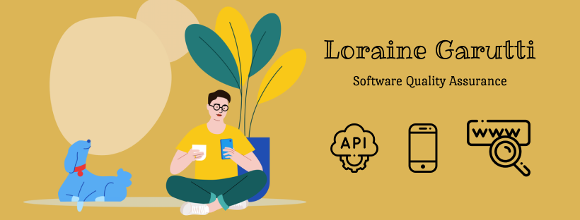

### Oláá, me chamo Loraine (ela/dela) 👋

Sou economista de formação, apaixonada por empreendedorismo e inovação.
Em 2020 fiz transição de carreira para TI e fui iniciada no mundo da Qualidade de Software.
Escrevo um pouco de Javascript, React.js, React Native e Ruby!

  

*Amo café (os de ótima qualidade ☕) e drinks (alô Negroni seu perfeito 🍹)*

Profissionalmente tenho facilidade em aprender testando e praticando, mas adoro ler artigos de frameworks e tecnologias novas.
Gosto muito de feedbacks, então seja bem-vinda caso queira submeter uns PR's nervosos 😆💻

<!--
**lorainegarutti/lorainegarutti** is a ✨ _special_ ✨ repository because its `README.md` (this file) appears on your GitHub profile.

Here are some ideas to get you started:

- 🔭 I’m currently working on ...
- 🌱 I’m currently learning ...
- 👯 I’m looking to collaborate on ...
- 🤔 I’m looking for help with ...
- 💬 Ask me about ...
- 📫 How to reach me: ...
- 😄 Pronouns: ...
- ⚡ Fun fact: ...
-->

Capa feita seguindo as dicas da Letícia! 😍 <a target="_blank" href="https://dev.to/dii_lua/github-profile-como-fazer-54o0">Acesse o site e aprenda também!</a>
Ícones feitos por <a target="_blank" href="https://www.flaticon.com/br/autores/freepik" title="Freepik">Freepik</a> from <a href="https://www.flaticon.com/br/" title="Flaticon"> www.flaticon.com</a>